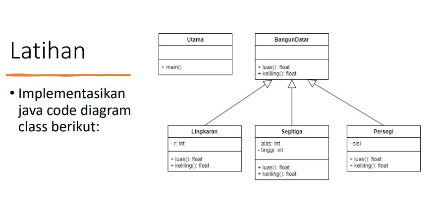
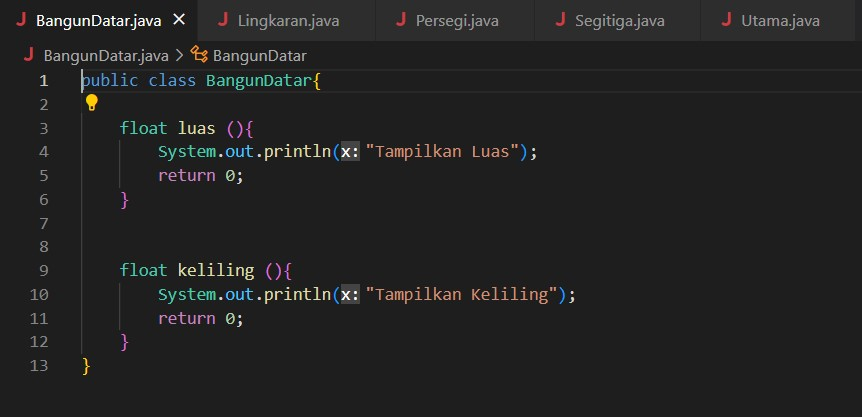
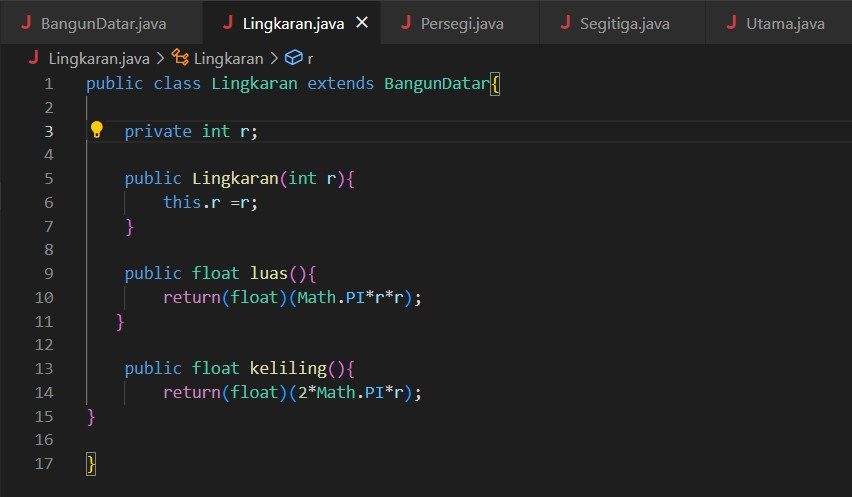
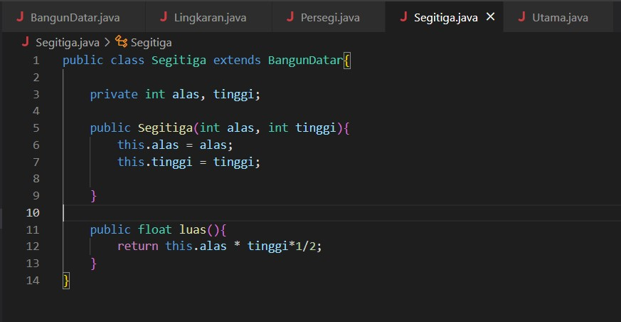
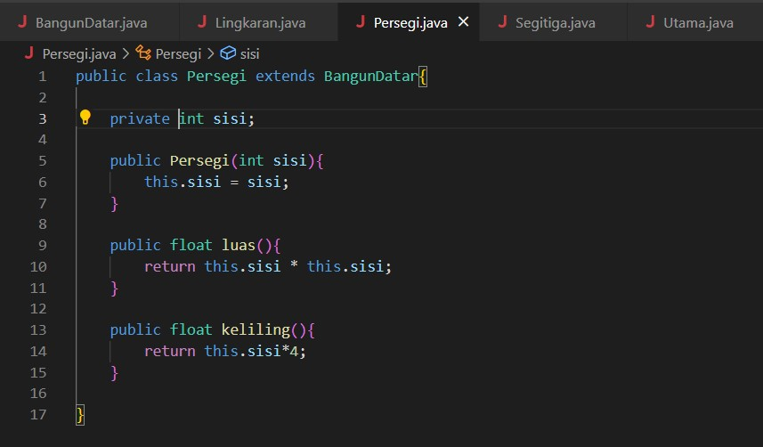
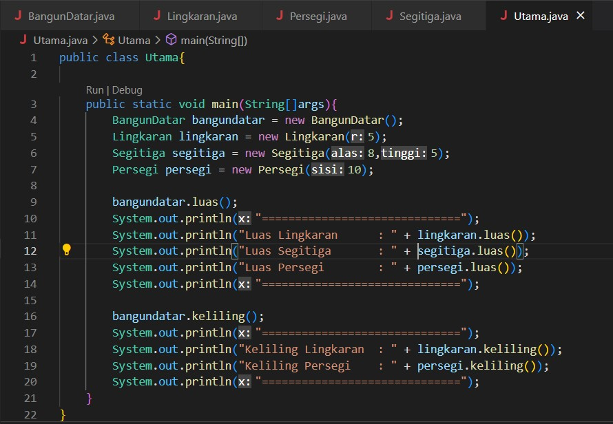
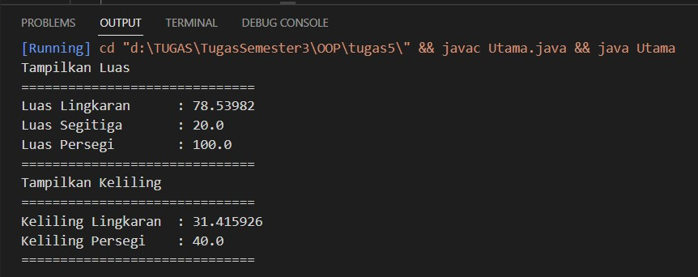

# Laporan Praktikum 4

- NAMA    : IMAM SOLEHUDIN
- NIM     : 312110290
- KELAS   : TI.21.C.1
- MATKUL  : PEMROGRAMAN ORIENTASI OBJECT

## SOAL!
## Implementasikan java code diagram class berikut:

1. Pada praktikum 4 ini membahas tentang polimorfisme yang memiliki arti banyak bentuk. pada praktikum kali ini akan mengimplementasikan java code dari diagram diatas.
2. Pertama kita buat superclass bernama BangunDatar yang memiliki method luas dan keliling yang bersifat public.

3. Selanjutnya buat subclass bernama Lingkaran, Persegi dan Segitiga.

4. Subclass Lingkaran memiliki atribut r bertype data integer dan bersifat private. Lalu buat method menghitung luas dan keliling untuk class lingkaran. berikut programnnya :

4. Subclass Persegi memiliki atribut sisi bertype data integer yang bersifat private. Untuk method sama seperti sebelumnya menghitung luas dan keliling segitiga. Berikut programnnya :

5. Subclass Segitiga memiliki atribut alas dan tinggi bertypedata integer dan bersifat private. Method mengitung luas segitiga. Berikut programnnya :

6. Yang terakhir kita buat file index, disini kita buat objek dan berinilai pada objek. berikut programnnya :

7. Hasil Program.

 